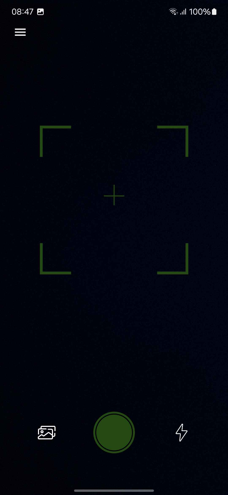
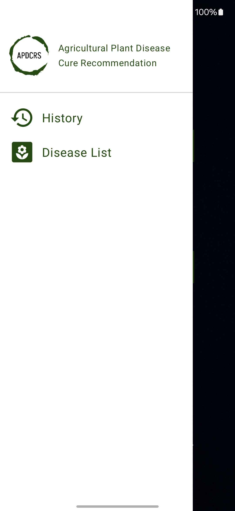
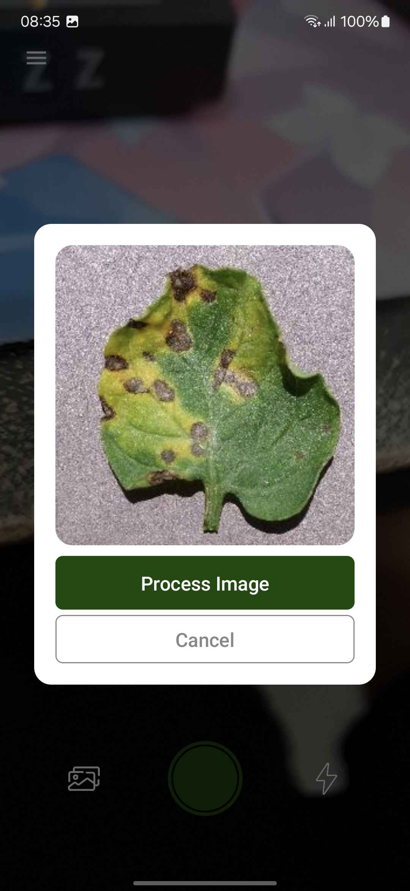
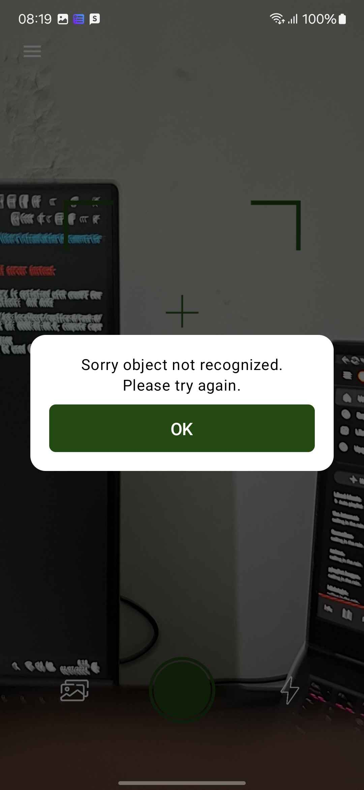
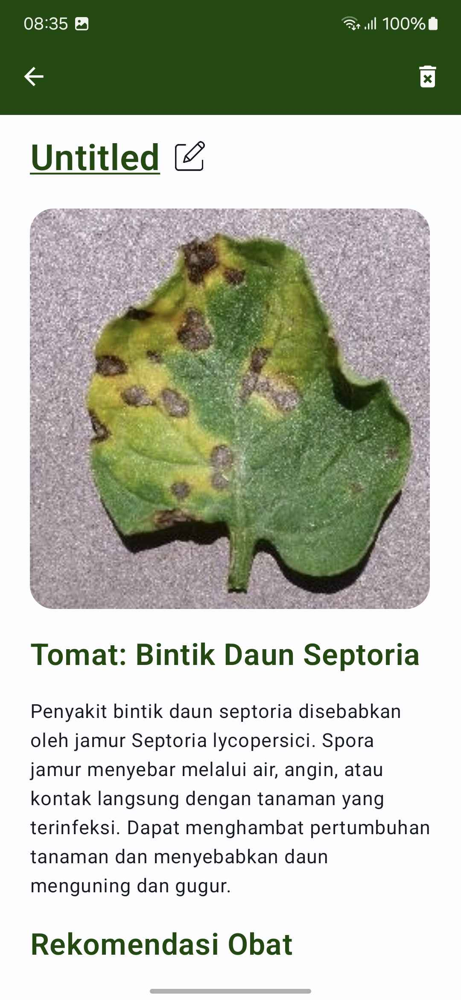
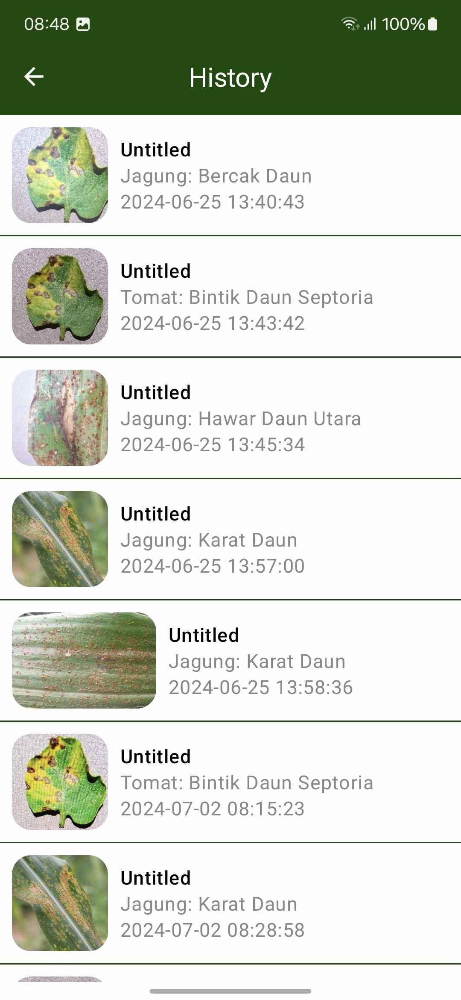
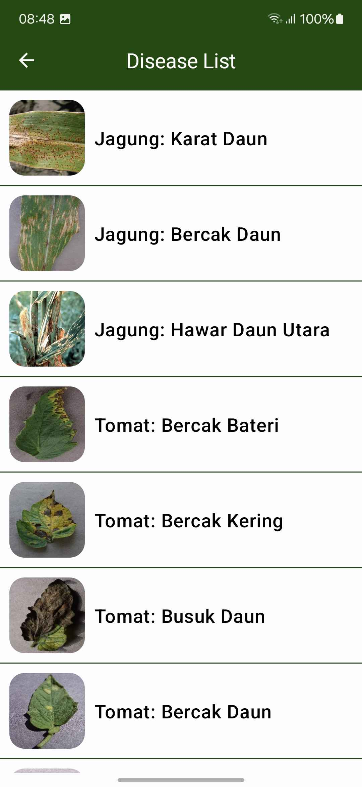

# Agriculture Plant Disease Cure Recommendation System (APDCRS)  
## Deskripsi Singkat
Sistem APDCRS adalah luaran tugas akhir dari mata kuliah Pemrograman Perangkat Bergerak (PPB) yang saya ambil pada Semester Genap 2023/2024. Sistem ini berfungsi sebagas sarana deteksi penyakit tanaman pada jagung dan tomat melalui gambar yang kemudian diproses untuk dicarikan rekomendasi obat untuk penyakit tersebut.  

Sistem ini dikembangkan menggunakan kotlin jetpack compose pada sisi android dan image recognition deep learning menggunakan python untuk fitur deteksi tanaman.  

## Tampilan Sistem
### Halaman Utama

### Menu

### Capture Berhasil

### Capture Gagal

### Hasil

### Histori

### Daftar Penyakit

